# Mazzady Platform — Use Case Diagram

## Complete UML Use Case Diagram (Mermaid Format)

Below is the full Use Case Diagram for the Mazzady Online Auction Platform. Copy this into any Mermaid-compatible renderer or use the PlantUML version below.

---

### Mermaid Diagram

```mermaid
graph TB
    subgraph System["🏛️ Mazzady Online Auction Platform"]
        direction TB

        subgraph Auth["Authentication & Registration"]
            UC_REG["Register Account<br/>(Email + National ID)"]
            UC_LOGIN["Login<br/>(Email/Password)"]
            UC_OAUTH["OAuth Sign-In<br/>(Google / Facebook)"]
            UC_VERIFY["Verify Email"]
            UC_PROFILE["Manage Profile"]
            UC_KYC["Identity Verification<br/>(KYC)"]
            UC_LOGOUT["Logout"]
        end

        subgraph Auctions["Auction Management"]
            UC_BROWSE["Browse Auctions<br/>(Category Filter)"]
            UC_VIEW_AUCTION["View Auction Details"]
            UC_BID["Place Bid"]
            UC_AUTO_BID["Set Up Auto-Bid"]
            UC_CREATE_AUCTION["Create Auction"]
            UC_SUBMIT_PRODUCT["Submit Product<br/>for Auction"]
            UC_FLASH["Create Flash Auction"]
            UC_GROUP["Join Group Auction"]
            UC_PRIVATE["Create Private Auction<br/>(Invite Code)"]
            UC_REVERSE["Create Reverse Auction"]
            UC_PROMOTE["Promote Auction"]
            UC_FEATURED["View Featured Auctions"]
        end

        subgraph Shopping["Shopping & Payments"]
            UC_CART["Manage Shopping Cart"]
            UC_PURCHASE["Purchase Items<br/>(Wallet Deduction)"]
            UC_INVOICE["View Invoice"]
            UC_TRACK["Track Shipping"]
            UC_DEPOSIT["Request Wallet Deposit"]
            UC_WALLET["View Wallet Balance"]
            UC_LOYALTY["Manage Loyalty Points"]
        end

        subgraph Social["Social & Communication"]
            UC_CHAT["Send/Receive Messages"]
            UC_RATE["Rate Seller"]
            UC_LIKE["Follow/Like Seller"]
            UC_WATCHLIST["Manage Watchlist"]
            UC_COMPARE["Compare Auctions"]
            UC_NOTIF["View Notifications"]
            UC_REPORT["Report Auction/User"]
            UC_SUPPORT["Submit Support Ticket"]
            UC_CHATBOT["AI Chatbot"]
        end

        subgraph Admin["Administration"]
            UC_ADMIN_LOGIN["Admin Login"]
            UC_DASHBOARD["View Dashboard Stats"]
            UC_MANAGE_USERS["Manage Users"]
            UC_APPROVE_PRODUCT["Approve/Reject Products"]
            UC_MANAGE_AUCTIONS["Manage All Auctions"]
            UC_APPROVE_DEPOSIT["Approve/Reject Deposits"]
            UC_RESPOND_SUPPORT["Respond to Support Tickets"]
            UC_REVIEW_REPORTS["Review Reports"]
            UC_VERIFY_KYC["Verify User Identity"]
            UC_BROADCAST["Send Broadcast Messages"]
            UC_MANAGE_HOME["Manage Homepage Content"]
            UC_MANAGE_JOBS["Manage Job Applications"]
            UC_MANAGE_SHIPPING["Update Shipping Status"]
        end

        subgraph Public["Public Features"]
            UC_HOME["View Homepage"]
            UC_PRIVACY["View Privacy Policy"]
            UC_DELETE_DATA["Request Data Deletion"]
            UC_APPLY_JOB["Submit Job Application"]
            UC_STATS["View Platform Statistics"]
        end
    end

    Guest(("👤 Guest"))
    Buyer(("🛒 Buyer"))
    Seller(("🏪 Seller"))
    User(("👥 Authenticated<br/>User"))
    AdminActor(("🔑 Admin"))

    Guest --> UC_HOME
    Guest --> UC_BROWSE
    Guest --> UC_VIEW_AUCTION
    Guest --> UC_REG
    Guest --> UC_LOGIN
    Guest --> UC_OAUTH
    Guest --> UC_PRIVACY
    Guest --> UC_DELETE_DATA
    Guest --> UC_APPLY_JOB
    Guest --> UC_STATS
    Guest --> UC_FEATURED

    Buyer --> UC_BID
    Buyer --> UC_AUTO_BID
    Buyer --> UC_CART
    Buyer --> UC_PURCHASE
    Buyer --> UC_INVOICE
    Buyer --> UC_TRACK
    Buyer --> UC_WATCHLIST
    Buyer --> UC_COMPARE
    Buyer --> UC_RATE
    Buyer --> UC_LIKE
    Buyer --> UC_REVERSE
    Buyer --> UC_GROUP
    Buyer --> UC_DEPOSIT
    Buyer --> UC_WALLET
    Buyer --> UC_LOYALTY

    Seller --> UC_SUBMIT_PRODUCT
    Seller --> UC_CREATE_AUCTION
    Seller --> UC_FLASH
    Seller --> UC_PRIVATE
    Seller --> UC_PROMOTE
    Seller --> UC_REVERSE

    User --> UC_PROFILE
    User --> UC_VERIFY
    User --> UC_KYC
    User --> UC_CHAT
    User --> UC_NOTIF
    User --> UC_REPORT
    User --> UC_SUPPORT
    User --> UC_CHATBOT
    User --> UC_LOGOUT

    AdminActor --> UC_ADMIN_LOGIN
    AdminActor --> UC_DASHBOARD
    AdminActor --> UC_MANAGE_USERS
    AdminActor --> UC_APPROVE_PRODUCT
    AdminActor --> UC_MANAGE_AUCTIONS
    AdminActor --> UC_APPROVE_DEPOSIT
    AdminActor --> UC_RESPOND_SUPPORT
    AdminActor --> UC_REVIEW_REPORTS
    AdminActor --> UC_VERIFY_KYC
    AdminActor --> UC_BROADCAST
    AdminActor --> UC_MANAGE_HOME
    AdminActor --> UC_MANAGE_JOBS
    AdminActor --> UC_MANAGE_SHIPPING
```

---

### PlantUML Version (for professional PDF generation)

```plantuml
@startuml Mazzady_Use_Case_Diagram

left to right direction
skinparam packageStyle rectangle
skinparam actorStyle awesome
skinparam usecase {
    BackgroundColor #E8F4FD
    BorderColor #2196F3
    ArrowColor #333333
}

title Mazzady Online Auction Platform - Use Case Diagram

actor "Guest" as Guest #LightGray
actor "Buyer" as Buyer #LightGreen
actor "Seller" as Seller #LightBlue
actor "Authenticated\nUser" as User #LightYellow
actor "Admin" as Admin #LightCoral

rectangle "Mazzady Platform" {

    package "Authentication & Registration" {
        usecase "Register Account\n(Email + National ID)" as UC1
        usecase "Login (Email/Password)" as UC2
        usecase "OAuth Sign-In\n(Google/Facebook)" as UC3
        usecase "Verify Email" as UC4
        usecase "Manage Profile" as UC5
        usecase "Identity Verification (KYC)" as UC6
        usecase "Logout" as UC7
    }

    package "Auction Management" {
        usecase "Browse Auctions\n(Category Filter)" as UC10
        usecase "View Auction Details" as UC11
        usecase "Place Bid" as UC12
        usecase "Set Up Auto-Bid" as UC13
        usecase "Submit Product for Auction" as UC14
        usecase "Create Auction" as UC15
        usecase "Create Flash Auction" as UC16
        usecase "Join Group Auction" as UC17
        usecase "Create Private Auction\n(Invite Code)" as UC18
        usecase "Create Reverse Auction" as UC19
        usecase "Promote Auction" as UC20
        usecase "View Featured Auctions" as UC21
    }

    package "Shopping & Payments" {
        usecase "Manage Shopping Cart" as UC30
        usecase "Purchase Items\n(Wallet Deduction)" as UC31
        usecase "View Invoice" as UC32
        usecase "Track Shipping" as UC33
        usecase "Request Wallet Deposit" as UC34
        usecase "View Wallet Balance" as UC35
        usecase "Manage Loyalty Points" as UC36
    }

    package "Social & Communication" {
        usecase "Send/Receive Chat Messages" as UC40
        usecase "Rate Seller (1-5 Stars)" as UC41
        usecase "Follow/Like Seller" as UC42
        usecase "Manage Watchlist" as UC43
        usecase "Compare Auctions/Products" as UC44
        usecase "View Notifications" as UC45
        usecase "Report Auction/User" as UC46
        usecase "Submit Support Ticket" as UC47
        usecase "AI Chatbot Interaction" as UC48
    }

    package "Administration" {
        usecase "Admin Login" as UC50
        usecase "View Dashboard Statistics" as UC51
        usecase "Manage Users" as UC52
        usecase "Approve/Reject Products" as UC53
        usecase "Manage All Auctions" as UC54
        usecase "Approve/Reject Deposits" as UC55
        usecase "Respond to Support Tickets" as UC56
        usecase "Review Reports" as UC57
        usecase "Verify User Identity (KYC)" as UC58
        usecase "Send Broadcast Messages" as UC59
        usecase "Manage Homepage Content" as UC60
        usecase "Manage Job Applications" as UC61
        usecase "Update Shipping Status" as UC62
    }

    package "Public Features" {
        usecase "View Homepage" as UC70
        usecase "View Privacy Policy" as UC71
        usecase "Request Data Deletion" as UC72
        usecase "Submit Job Application" as UC73
        usecase "View Platform Statistics" as UC74
    }
}

' Guest connections
Guest --> UC70
Guest --> UC10
Guest --> UC11
Guest --> UC1
Guest --> UC2
Guest --> UC3
Guest --> UC71
Guest --> UC72
Guest --> UC73
Guest --> UC74
Guest --> UC21

' Buyer connections
Buyer --> UC12
Buyer --> UC13
Buyer --> UC30
Buyer --> UC31
Buyer --> UC32
Buyer --> UC33
Buyer --> UC43
Buyer --> UC44
Buyer --> UC41
Buyer --> UC42
Buyer --> UC19
Buyer --> UC17
Buyer --> UC34
Buyer --> UC35
Buyer --> UC36

' Seller connections
Seller --> UC14
Seller --> UC15
Seller --> UC16
Seller --> UC18
Seller --> UC20
Seller -[#blue]-> UC19 : "Bid on\nbuyer requests"

' Authenticated User connections
User --> UC5
User --> UC4
User --> UC6
User --> UC40
User --> UC45
User --> UC46
User --> UC47
User --> UC48
User --> UC7

' Admin connections
Admin --> UC50
Admin --> UC51
Admin --> UC52
Admin --> UC53
Admin --> UC54
Admin --> UC55
Admin --> UC56
Admin --> UC57
Admin --> UC58
Admin --> UC59
Admin --> UC60
Admin --> UC61
Admin --> UC62

' Include/Extend relationships
UC31 ..> UC32 : <<include>>
UC31 ..> UC33 : <<include>>
UC12 ..> UC45 : <<include>>
UC1 ..> UC4 : <<include>>
UC3 ..> UC5 : <<extend>>
UC15 ..> UC53 : <<include>>

@enduml
```

---

## How to Generate

### Option 1: Mermaid (Online)

1. Go to [mermaid.live](https://mermaid.live)
2. Paste the Mermaid diagram code above
3. Export as PNG/SVG/PDF

### Option 2: PlantUML (Professional)

1. Go to [plantuml.com](https://www.plantuml.com/plantuml/uml)
2. Paste the PlantUML code above
3. Generate and download as PNG/SVG/PDF

### Option 3: Draw.io

1. Go to [draw.io](https://app.diagrams.net)
2. Use the diagram structure above as reference
3. Create manually for the best visual result
